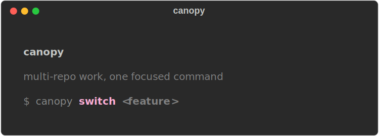
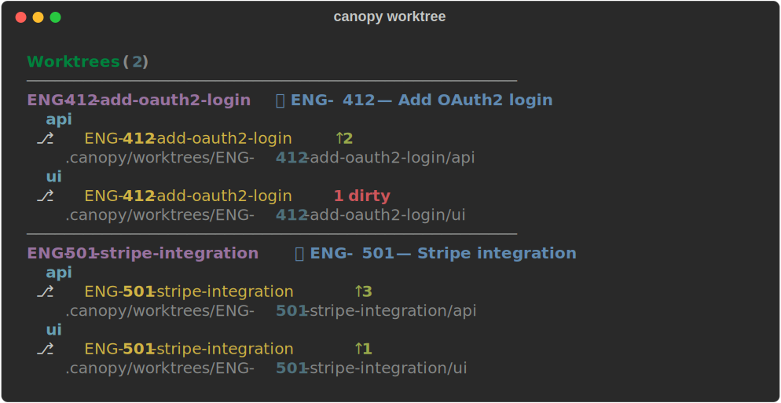
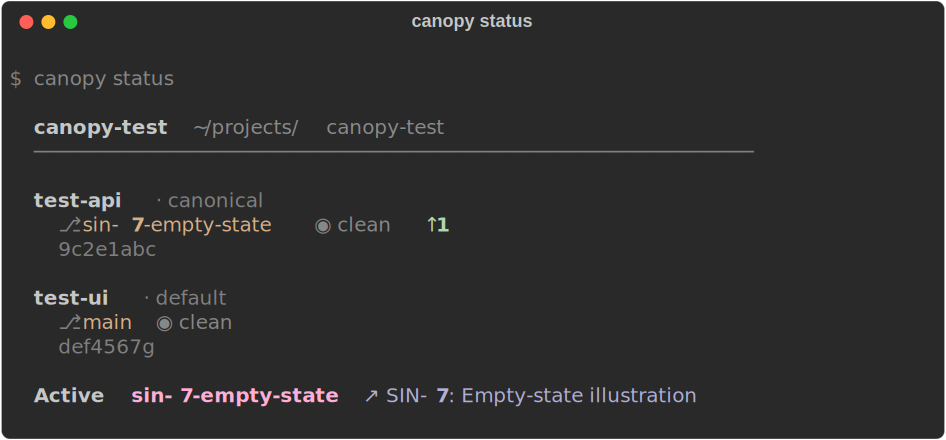
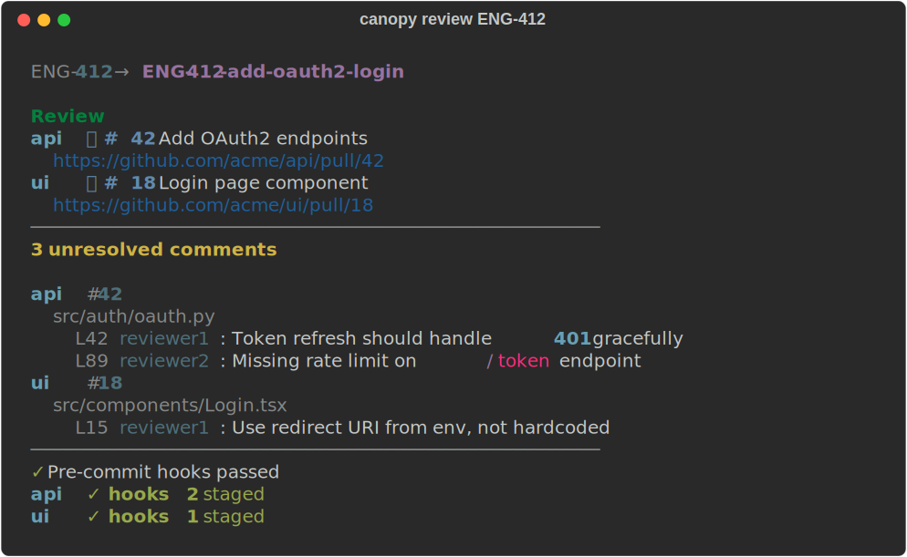
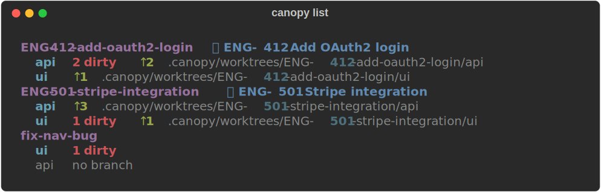

<p align="center">
  
</p>

<p align="center">
  <strong>Multi-repo worktree manager with MCP server for AI agents</strong>
</p>

<p align="center">
  
  
  
  <a href="https://marketplace.visualstudio.com/items?itemName=SingularityInc.canopy"></a>
  
</p>

---

Canopy coordinates Git worktrees across multiple repositories. It creates isolated working directories for each feature, opens them in your IDE, runs pre-commit checks, and exposes every operation as both a CLI command and an MCP tool — so AI agents can operate your workspace through the same interface you use.

## Why

Working on a feature that spans multiple repos means coordinating branches, switching, and managing worktrees across all of them. Git worktrees solve the context-switching problem, but the UX for managing them across multiple repos doesn't exist. Canopy provides it: one command to create worktrees in every repo, one command to open them in your IDE, one command to check everything before you commit.

## How It Looks

<p align="center">
  
</p>

<details>
<summary>More CLI screenshots</summary>
<br>
<p align="center">
  <br>
  <br>
  
</p>
</details>

## Install

Requires Python 3.10+.

```bash
pipx install git+https://github.com/ashmitb95/canopy.git
```

If you don't have pipx: `brew install pipx && pipx ensurepath`.

Or from source, for contributors:

```bash
git clone https://github.com/ashmitb95/canopy.git ~/projects/canopy
cd ~/projects/canopy && pip install -e .
```

## Quick Start

```bash
cd ~/my-product/
canopy init                                        # scan for repos, generate canopy.toml

canopy worktree ENG-412-add-oauth2-login ENG-412   # create worktrees + link Linear issue
canopy code ENG-412                                # open in VS Code (alias resolves)
canopy preflight                                   # stage + run pre-commit hooks
canopy done ENG-412                                # clean up when merged
```

## VSCode Extension

Prefer a sidebar over the CLI? Install **[Canopy](https://marketplace.visualstudio.com/items?itemName=SingularityInc.canopy)** from the VSCode marketplace — features, worktrees, per-repo changes, and review readiness in one native panel, backed by the same MCP tools the CLI uses.

## MCP

Every CLI operation is available as an MCP tool:

```json
{
  "mcpServers": {
    "canopy": {
      "command": "canopy-mcp",
      "env": { "CANOPY_ROOT": "/path/to/workspace" }
    }
  }
}
```

Canopy is also an MCP client — it spawns external MCP servers (Linear, GitHub) to fetch issue and PR data, so there are zero direct API integrations in the codebase.

## Docs

- **[Commands](docs/commands.md)** — full CLI reference
- **[MCP Integration](docs/mcp.md)** — server tool list + client configuration
- **[Workspace](docs/workspace.md)** — layout, `canopy.toml`, alias resolution, context detection
- **[Architecture](docs/architecture.md)** — module boundaries and design rules

## Development

```bash
cd ~/projects/canopy
pip install -e ".[dev]"
pytest tests/ -v             # 192 tests, ~2s, all use real temporary Git repos
```

## License

MIT
