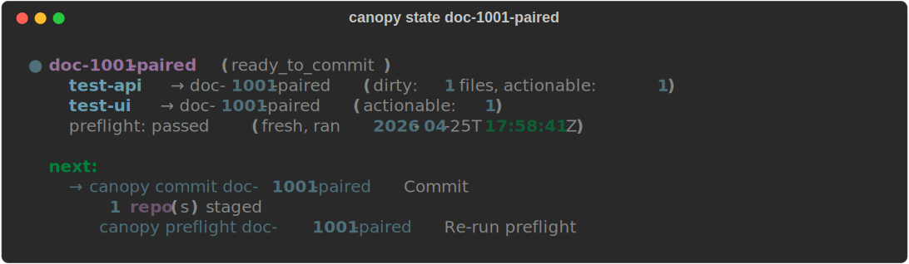
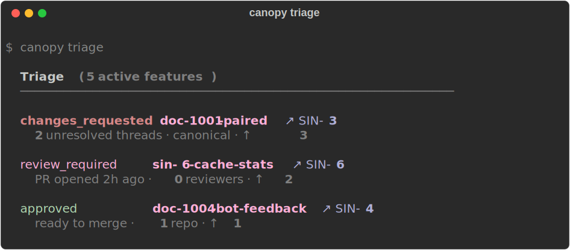
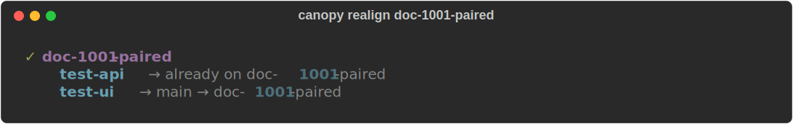
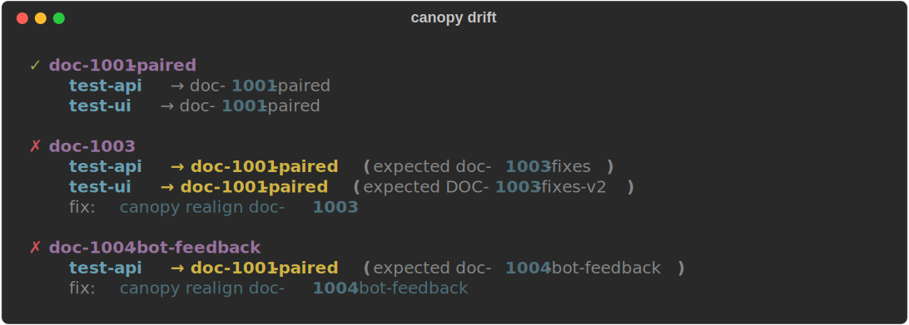

<p align="center">
  
</p>

<p align="center">
  <strong>Context contract for AI agents · drift-proof CLI enabler for you</strong>
</p>

<p align="center">
  
  
  
  <a href="https://marketplace.visualstudio.com/items?itemName=SingularityInc.canopy"></a>
  
</p>

---

Canopy gives you and your AI agent a **mistake-proof grip on multi-repo workflows**. Every operation takes semantic context (a feature name, a repo name) and resolves paths internally — the agent literally can't run a command in the wrong directory because it never specifies a directory. Drift across repos is detected in real time and surfaced as one fix command. PR review comments get temporally classified (actionable vs likely-resolved) so context budget goes to comprehension, not orchestration.

Same operations, two surfaces:
- **CLI** — `canopy triage`, `canopy state`, `canopy realign` — for you at a terminal.
- **MCP server + skill** — `mcp__canopy__*` — for any AI agent. Ships with a [`using-canopy`](src/canopy/agent_setup/skill.md) skill that teaches Claude Code (and others) when to prefer canopy over raw bash.

## Why

Multi-repo work breaks in four specific ways. Canopy fixes each:

| Failure mode | Canopy's fix |
|---|---|
| You switch one repo's branch, forget the other; next push goes to the wrong place | A post-checkout hook records every HEAD change to `.canopy/state/heads.json`. `canopy drift` catches mismatches; `canopy realign <feature>` fixes them in one command. |
| Your agent shells `cd /wrong/repo && command` because shell state doesn't persist between tool calls | Every canopy tool takes `feature` / `repo` as parameters. Path resolution lives in canopy. The agent has no surface area for the mistake. |
| PR review comments pile up across repos with no unified view; agent burns context re-deriving "is this still actionable" | `canopy triage` enumerates open PRs, groups by feature, prioritizes by review state. `canopy comments <feature>` returns threads pre-classified as `actionable_threads` vs `likely_resolved_threads` (validated against 4 real PRs). |
| Pre-commit checks differ per repo; the agent doesn't know which to run | `canopy preflight <feature>` runs the right checks per repo. Result is recorded so `canopy state` knows whether you're `in_progress` or `ready_to_commit`. |

## How It Looks

<p align="center">
  
</p>

<details>
<summary>More CLI screenshots</summary>
<br>
<p align="center">
  <br>
  <br>
  <br>
  
</p>
</details>

## Install

Requires Python 3.10+.

```bash
pipx install git+https://github.com/ashmitb95/canopy.git
```

If you don't have pipx: `brew install pipx && pipx ensurepath`.

## First-run

```bash
cd ~/your-multi-repo-workspace
canopy init
```

`canopy init` does five things in one shot:

1. Discovers Git repos and writes `canopy.toml`
2. Installs `post-checkout` hooks per repo (drift detection)
3. Installs the [`using-canopy`](src/canopy/agent_setup/skill.md) skill at `~/.claude/skills/using-canopy/SKILL.md`
4. Registers `canopy-mcp` in the workspace's `.mcp.json`
5. Reports what changed

Restart Claude Code (or your MCP client) and you're ready. Skip the agent bits with `--no-agent`.

## The daily loop

```bash
canopy triage                  # what should I work on first?
canopy state <feature>         # where am I, what's next?
canopy realign <feature>       # if drifted, switch all repos to the right branch
canopy comments <feature>      # actionable review threads only — not likely-resolved noise
canopy preflight <feature>     # run the per-repo checks
```

`canopy state` returns one of 8 states (`drifted`, `needs_work`, `in_progress`, `ready_to_commit`, `ready_to_push`, `awaiting_review`, `approved`, `no_prs`) plus a `next_actions` array. The agent reads the array; you read the colored output. Same JSON.

## For AI agents

Canopy ships with a [`using-canopy`](src/canopy/agent_setup/skill.md) skill (installed by `canopy init`) and an MCP server with 43 tools. The skill teaches the agent: *use canopy MCP for path-safe multi-repo ops*. After install, an agent in a workspace where canopy is configured will:

- Call `mcp__canopy__triage` instead of parsing `gh pr list` output across repos
- Call `mcp__canopy__realign` instead of `cd repo && git checkout` per repo
- Call `mcp__canopy__run(repo='ui', command='pnpm test')` instead of `cd /path && pnpm test`
- Read `mcp__canopy__feature_state(feature).next_actions` to know what to do next

Linear MCP works via OAuth (browser flow once, no API key). GitHub works via `gh` CLI fallback when MCP isn't configured. See [docs/agents.md](docs/agents.md) for the full integration story.

## For humans

Same operations as a CLI (full reference in [docs/commands.md](docs/commands.md)). Plus a [VSCode extension](https://marketplace.visualstudio.com/items?itemName=SingularityInc.canopy) with the same state-machine view as the agent — features, drift, PR triage, review readiness in one native panel.

## Docs

- [Concepts](docs/concepts.md) — the action framework, agent context contract, 8-state machine
- [Agents](docs/agents.md) — skill, `setup-agent`, integration recipes
- [Commands](docs/commands.md) — full CLI reference, organized by workflow stage
- [MCP](docs/mcp.md) — server tool list, client transports (stdio + HTTP/OAuth), gh fallback
- [Workspace](docs/workspace.md) — `canopy.toml`, `features.json`, state files, mcp.json
- [Architecture](docs/architecture.md) — module boundaries and design rules

## Develop

```bash
git clone https://github.com/ashmitb95/canopy.git ~/projects/canopy
cd ~/projects/canopy
pip install -e ".[dev]"
pytest tests/ -v             # 354 tests, ~60s, all use real temporary Git repos
```

## License

MIT
