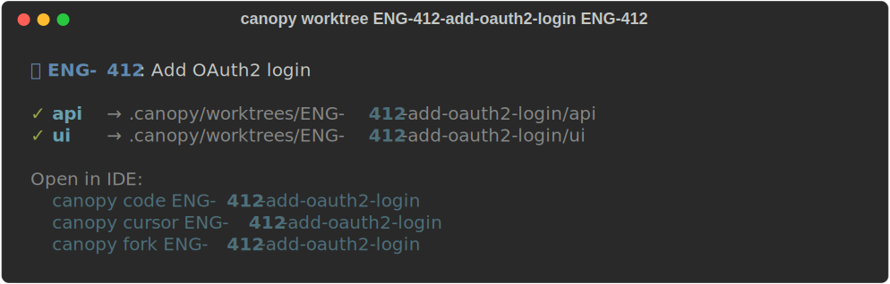
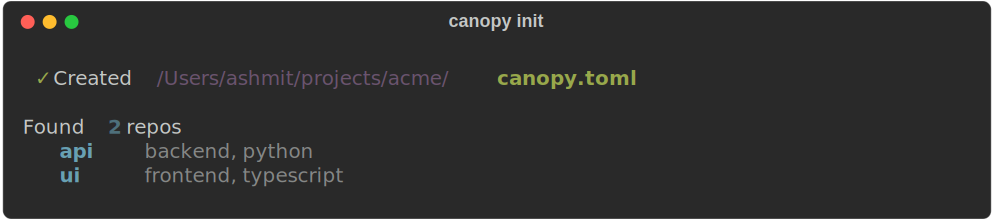
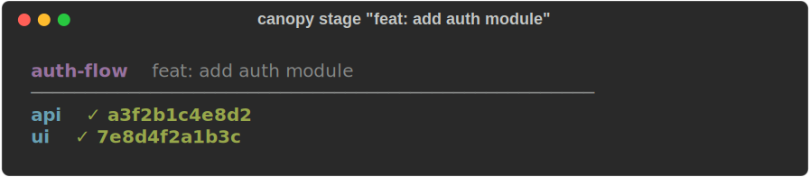
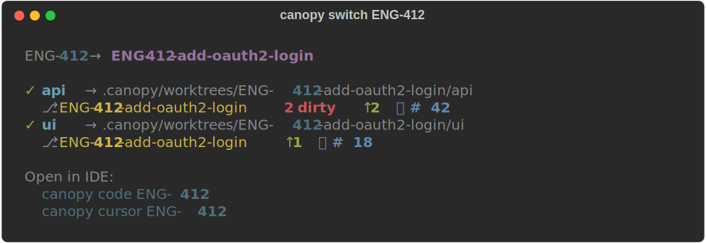
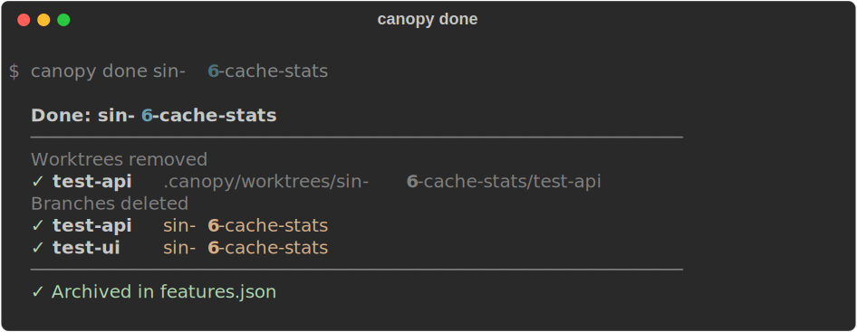
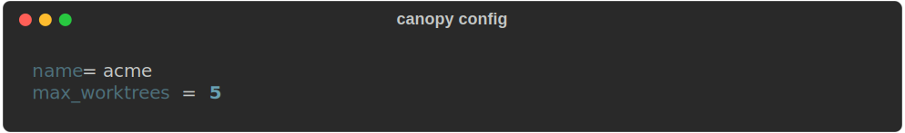

<p align="center">
  
</p>

<p align="center">
  <strong>Multi-repo worktree manager with MCP server for AI agents</strong>
</p>

<p align="center">
  
  
  <a href="#mcp-server"></a>
  
</p>

---

Canopy coordinates Git worktrees across multiple repositories. It creates isolated working directories for each feature, opens them in your IDE, runs pre-commit checks, and exposes every operation as both a CLI command and an MCP tool — so AI agents can operate your workspace through the same interface you use.

## Why

Working on a feature that spans multiple repos means coordinating branches, switching, and managing worktrees across all of them. Git worktrees solve the context-switching problem, but the UX for managing them across multiple repos doesn't exist. Canopy provides it: one command to create worktrees in every repo, one command to open them in your IDE, one command to check everything before you commit.

## How It Looks

<details open>
<summary><strong><code>canopy worktree</code></strong> — live worktree dashboard</summary>
<br>
<p align="center">
  
</p>
</details>

<details>
<summary><strong><code>canopy worktree ENG-412-add-oauth2-login ENG-412</code></strong> — create with Linear link</summary>
<br>
<p align="center">
  
</p>
</details>

<details>
<summary><strong><code>canopy status</code></strong> — cross-repo status</summary>
<br>
<p align="center">
  
</p>
</details>

<details>
<summary><strong><code>canopy init</code></strong> — workspace init</summary>
<br>
<p align="center">
  
</p>
</details>

<details>
<summary><strong><code>canopy preflight</code></strong> — pre-commit quality gate</summary>
<br>
<p align="center">
  
</p>
</details>

<details>
<summary><strong><code>canopy list</code></strong> — feature overview</summary>
<br>
<p align="center">
  
</p>
</details>

<details>
<summary><strong><code>canopy switch ENG-412</code></strong> — switch to feature lane</summary>
<br>
<p align="center">
  
</p>
</details>

<details>
<summary><strong><code>canopy review ENG-412</code></strong> — PR comments + pre-commit + staging</summary>
<br>
<p align="center">
  
</p>
</details>

<details>
<summary><strong><code>canopy done ENG-412</code></strong> — feature cleanup</summary>
<br>
<p align="center">
  
</p>
</details>

<details>
<summary><strong><code>canopy config</code></strong> — workspace settings</summary>
<br>
<p align="center">
  
</p>
</details>

## Installation

```bash
git clone https://github.com/ashmitb95/canopy.git
cd canopy

python3 -m venv .venv
source .venv/bin/activate   # On Windows: .venv\Scripts\activate

pip install -e .
```

To make `canopy` available globally without activating the venv:

```bash
# Add to ~/.zshrc or ~/.bashrc
export PATH="$HOME/projects/canopy/.venv/bin:$PATH"
```

## Quick Start

```bash
cd ~/my-product/
canopy init                                        # scan for repos, generate canopy.toml

canopy worktree ENG-412-add-oauth2-login ENG-412   # create worktrees + link Linear issue
canopy worktree ENG-501-stripe-integration ENG-501 # another feature lane

canopy code ENG-412                                # open in VS Code (alias resolves)
canopy cursor ENG-412                              # open in Cursor
canopy fork ENG-412                                # open in Fork.app

canopy switch ENG-412                              # checkout feature across all repos
canopy preflight                                       # stage + run hooks (does not commit)
canopy done ENG-412                                # clean up when done
```

## Workspace Layout

```
my-product/
├── canopy.toml              ← workspace definition (which repos, roles, languages)
├── api/                     ← main working tree (on main)
├── ui/                      ← main working tree (on main)
└── .canopy/
    ├── features.json        ← feature lane metadata + Linear issue links + aliases
    ├── mcps.json            ← external MCP server configs (Linear, etc.)
    └── worktrees/
        ├── ENG-412-add-oauth2-login/  ← isolated feature environment
        │   ├── api/                   ← linked worktree on ENG-412-add-oauth2-login branch
        │   └── ui/                    ← linked worktree on ENG-412-add-oauth2-login branch
        └── ENG-501-stripe-integration/
            ├── api/
            └── ui/
```

## Commands

### Worktrees

| Command | Description |
|---|---|
| `canopy worktree <name>` | Create linked worktrees for a feature across all repos |
| `canopy worktree <name> <issue>` | Same, with a Linear issue link (fetched via MCP) |
| `canopy worktree` | Live dashboard — shows branch, dirty state, ahead/behind per worktree |

### Core

| Command | Description |
|---|---|
| `canopy init` | Scan subdirectories, detect Git repos and worktrees, generate `canopy.toml` |
| `canopy status` | Per-repo branch, dirty count, divergence from default branch |
| `canopy preflight` | Context-aware `git add -A` + run pre-commit hooks — does not commit |
| `canopy context` | Debug: show detected context type, feature, repos, paths |

### Feature Lanes

| Command | Description |
|---|---|
| `canopy feature create <name>` | Create branches (no worktrees) across repos |
| `canopy feature list` | List all lanes with per-repo state |
| `canopy feature switch <name>` | Checkout branch in each repo — worktree-aware, alias-aware |
| `canopy feature diff <name>` | Aggregate diff vs default branch + cross-repo type overlap detection |
| `canopy feature status <name>` | Detailed per-repo state + merge readiness check |

All feature commands accept aliases (Linear ID or unique prefix) in place of the full feature name.

### IDE Integration

| Command | Description |
|---|---|
| `canopy code <feature\|.>` | Generate `.code-workspace` and open VS Code (alias-aware) |
| `canopy cursor <feature\|.>` | Generate `.code-workspace` and open Cursor (alias-aware) |
| `canopy fork <feature\|.>` | Open each repo in Fork.app (alias-aware) |

### Review

| Command | Description |
|---|---|
| `canopy review <feature>` | Review readiness — PR status, unresolved comments, pre-commit checks (alias-aware) |

### Workspace Management

| Command | Description |
|---|---|
| `canopy list` | Compact feature overview — name, Linear link, per-repo branch/dirty/ahead-behind |
| `canopy switch <name>` | Checkout feature across all repos — shows branch, dirty count, ahead/behind, PR links |
| `canopy done <feature>` | Clean up completed feature — remove worktrees, delete branches, archive |
| `canopy config [key] [value]` | Read/write workspace settings (e.g. `max_worktrees`) |

### Cross-Repo Git

| Command | Description |
|---|---|
| `canopy checkout <branch>` | Checkout across all repos |
| `canopy log` | Interleaved chronological log across repos |
| `canopy sync` | Pull default branch, rebase feature branches |
| `canopy branch list\|delete\|rename` | Branch management across repos |
| `canopy stash save\|pop\|list\|drop` | Stash lifecycle across repos |

Every command supports `--json` for machine-readable output.

## MCP Server

Canopy is an MCP server. Every CLI operation is exposed as a tool (28 total) over stdio transport, so AI agents can operate your workspace programmatically.

```bash
canopy-mcp   # starts the server
```

Register in Claude Code, Cursor, or any MCP-compatible client:

```json
{
  "mcpServers": {
    "canopy": {
      "command": "canopy-mcp",
      "env": { "CANOPY_ROOT": "/path/to/workspace" }
    }
  }
}
```

| Tool | Description |
|---|---|
| `workspace_status` | Full workspace status across all repos |
| `workspace_context` | Detect canopy context from a directory path |
| `workspace_config` | Read or write workspace settings in canopy.toml |
| `feature_create` | Create a new feature lane across repos |
| `feature_list` | List all active feature lanes with repo states |
| `feature_status` | Detailed status for a feature lane |
| `feature_switch` | Switch to a feature lane across repos (alias-aware) |
| `feature_diff` | Aggregate diff for a feature lane across repos |
| `feature_merge_readiness` | Check if a feature is ready to merge |
| `feature_paths` | Get working directory paths for each repo in a feature |
| `feature_done` | Clean up a feature — remove worktrees, delete branches, archive |
| `worktree_create` | Create worktrees for a feature, optionally linked to a Linear issue |
| `worktree_info` | Live worktree status across the workspace |
| `checkout` | Checkout a branch across repos |
| `preflight` | Context-aware pre-commit quality gate — stages + runs hooks, does not commit |
| `log` | Interleaved commit log across repos, sorted by date |
| `sync` | Pull default branch, rebase feature branches |
| `branch_list` | List branches across repos |
| `branch_delete` | Delete a branch across repos |
| `branch_rename` | Rename a branch across repos |
| `stash_save` | Stash uncommitted changes across repos |
| `stash_pop` | Pop stash across repos |
| `stash_list` | List stash entries across repos |
| `stash_drop` | Drop a stash entry across repos |
| `review_status` | Check if PRs exist for a feature |
| `review_comments` | Fetch unresolved PR review comments for a feature |
| `review_prep` | Run pre-commit hooks and stage changes for a feature |

## MCP Client

Canopy is also an MCP **client**. Rather than adding direct API integrations (Linear SDK, GitHub SDK, etc.), canopy spawns external MCP servers as subprocesses and calls their tools via the standard MCP protocol. This means:

- Zero external API dependencies in the canopy codebase
- Any MCP server can be plugged in via config
- Integrations work through the same protocol AI agents use

Configuration lives in `.canopy/mcps.json`:

```json
{
  "linear": {
    "command": "npx",
    "args": ["-y", "@modelcontextprotocol/server-linear"],
    "env": { "LINEAR_API_KEY": "lin_api_..." }
  }
}
```

The client module (`mcp/client.py`) uses the `mcp` SDK's `ClientSession` + `stdio_client` to spawn the server, call tools, and return results. A synchronous wrapper handles event loop management for CLI use.

Currently powers:
- **Linear integration** — `canopy worktree <name> ENG-123` spawns the Linear MCP, fetches the issue title/URL, and stores the link in `features.json`.
- **GitHub integration** — `canopy review <feature>` spawns the GitHub MCP to find the PR for a branch and fetch unresolved review comments.

## Context Detection

`canopy preflight` and other context-aware commands work by detecting where you are in the filesystem:

| Context | Detection | Scope |
|---|---|---|
| `feature_dir` | Inside `.canopy/worktrees/<feature>/` | All repos in the feature |
| `repo_worktree` | Inside `.canopy/worktrees/<feature>/<repo>/` | Single repo |
| `repo` | Inside a workspace repo directory | Single repo (feature = current branch if non-default) |
| `workspace_root` | At the `canopy.toml` level | All repos |

This is implemented in `workspace/context.py` and powers `canopy preflight`, `canopy context`, and the MCP `preflight` tool.

## Alias Resolution

Every command that accepts a feature name also accepts a short alias. You don't need to type the full `ENG-412-add-oauth2-login` — just `ENG-412` is enough.

Resolution order:

1. **Exact match** — if the name matches a feature exactly, use it.
2. **Prefix match** — if exactly one feature starts with the given string, resolve to it. `ENG-412` resolves to `ENG-412-add-oauth2-login`. If multiple features share the prefix, canopy raises an error listing the ambiguous matches.
3. **Linear issue match** — if the string matches the `linear_issue` field stored in `features.json` (case-insensitive), resolve to that feature.

This works across all feature-aware commands: `switch`, `status`, `diff`, `done`, `review`, `code`, `cursor`, `fork`, and all corresponding MCP tools. When an alias resolves, the CLI shows the resolution (`ENG-412 → ENG-412-add-oauth2-login`) so you always know what happened.

The recommended naming convention is `{LINEAR_ID}-{slugified-title}` (e.g., `ENG-412-add-oauth2-login`). When you create a feature with a Linear issue link, canopy stores the issue ID in `features.json`, making the short alias available immediately.

## Architecture

```
src/canopy/
├── cli/
│   ├── main.py              # argparse CLI — thin layer, no business logic
│   └── ui.py                # rich terminal output (theme, spinners, colors)
├── workspace/
│   ├── config.py            # canopy.toml parser (RepoConfig, WorkspaceConfig)
│   ├── discovery.py         # auto-detect repos + worktrees, generate toml
│   ├── context.py           # context detection from cwd
│   └── workspace.py         # Workspace class, RepoState dataclass
├── git/
│   ├── repo.py              # ALL git subprocess calls (single-repo only)
│   └── multi.py             # cross-repo operations (calls repo.py)
├── features/
│   └── coordinator.py       # feature lane lifecycle, worktree creation, live scanning
├── integrations/
│   ├── linear.py            # Linear issue fetching (via mcp/client.py)
│   ├── github.py            # GitHub PR + review comments (via mcp/client.py)
│   └── precommit.py         # detect and run pre-commit hooks (framework or git hooks)
└── mcp/
    ├── server.py            # MCP server — 27 tools, stdio transport
    └── client.py            # MCP client — spawn + call external MCP servers
```

**Key boundary:** `git/repo.py` is the only module that calls `subprocess.run(["git", ...])`. Everything else goes through it. This makes the git layer replaceable and testable.

**Key boundary:** `mcp/server.py` and `cli/main.py` are thin wrappers. Business logic lives in `features/coordinator.py`, `git/multi.py`, and `workspace/`.

**Key boundary:** All external integrations go through `mcp/client.py`. No direct API calls anywhere in the codebase.

## canopy.toml

```toml
[workspace]
name = "my-product"
max_worktrees = 5          # optional: cap active worktrees (0 = unlimited)

[[repos]]
name = "api"
path = "./api"
role = "backend"
lang = "python"

[[repos]]
name = "ui"
path = "./ui"
role = "frontend"
lang = "typescript"
```

Generated by `canopy init`. Worktrees are detected automatically — canopy distinguishes `.git` directories (normal repos) from `.git` files (linked worktrees) and tags them with `is_worktree` and `worktree_main`.

## Development

```bash
cd ~/projects/canopy
source .venv/bin/activate
pip install -e ".[dev]"
pytest tests/ -v             # 187 tests, ~2s, all use real temporary Git repos
```

Tests create real Git repositories in temporary directories — no mocks. This catches actual git behavior differences across platforms.

## License

MIT
